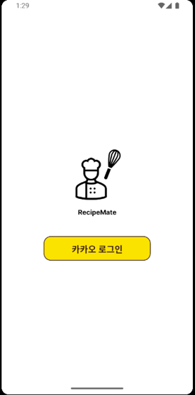
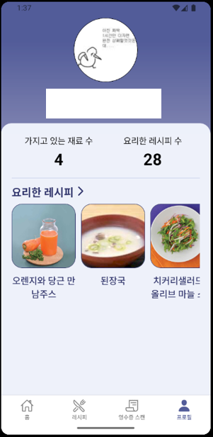
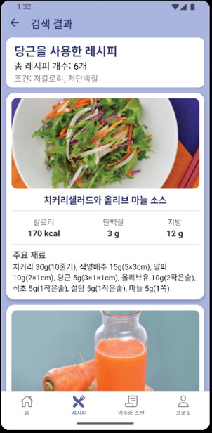

# RecipeMate Frontend

## 📝 Introduce

RecipeMate 모바일 앱 프론트엔드, 영수증 이미지 촬영 또는 갤러리 선택을 통한 식재료 인식 기능.
AI OCR 기반 식재료 자동 등록 기능.
식재료 기반 레시피 검색 기능.
식재료 관리 기능.
배지 시스템 포함 편의 기능.

## 설치 및 실행 방법
### 요구사항
- Node.js 18 이상
- React Native CLI
- Android Studio / Xcode (에뮬레이터 및 디바이스 빌드용)

### 설치 및 실행
```bash
npm install
npx react-native run-android
```

## ⚙️ Develop Environment

<div align="center">
	
</div>

## 📝 Feature

### 로그인 / 회원가입
- 카카오 소셜로그인 구현 (인가코드 발급 → 백엔드 서버로 전송)
- 자체 회원가입/로그인 지원

||
|:-:|
|첫화면|

### 홈 / 식재료 관리 / 배지
- 홈화면에서 내 식재료 현황, 배지, 최근 요리 내역 등 확인 가능
- 식재료 추가/삭제/수정, 보유 식재료 리스트 관리
- 배지 획득 및 목록 확인

||||
|:-:|:-:|:-:|
|홈 화면|식재료 관리|배지 목록|

### 영수증 OCR 기반 식재료 등록
- 영수증을 카메라로 촬영하거나, 갤러리에서 이미지를 선택하여 AI OCR로 식재료 자동 인식
- 인식된 식재료를 편집 후 내 식재료로 등록 가능

|||
|:-:|:-:|
|영수증 촬영|OCR 결과 및 식재료 등록|

### 레시피 검색 / 상세페이지
- 보유 식재료 기반 레시피 검색 (영양성분 조건 필터 지원)
- 레시피 상세 정보, 조리법, 필요한 재료 등 확인 가능

||||
|:-:|:-:|:-:|
|레시피 검색|결과|상세페이지|

### 기타 기능
- 네비게이션(탭/스택) 기반 화면 이동
- 사용자 프로필/정보 관리
- 앱 내 다양한 안내 및 에러 처리

## 📁 주요 폴더 구조

```
app_front/
 ├─ App.js                # 앱 진입점
 ├─ screens/              # 주요 화면 컴포넌트
 ├─ src/context/          # Context API (인증, 식재료 등)
 ├─ src/services/         # API 서비스 모듈
 ├─ assets/               # 이미지 등 정적 리소스
 ├─ config/               # 환경설정
 └─ ...
```

## 💡 기타
- 개발/테스트 시 Android Studio 또는 Xcode 에뮬레이터 사용 권장
---

#codebase
